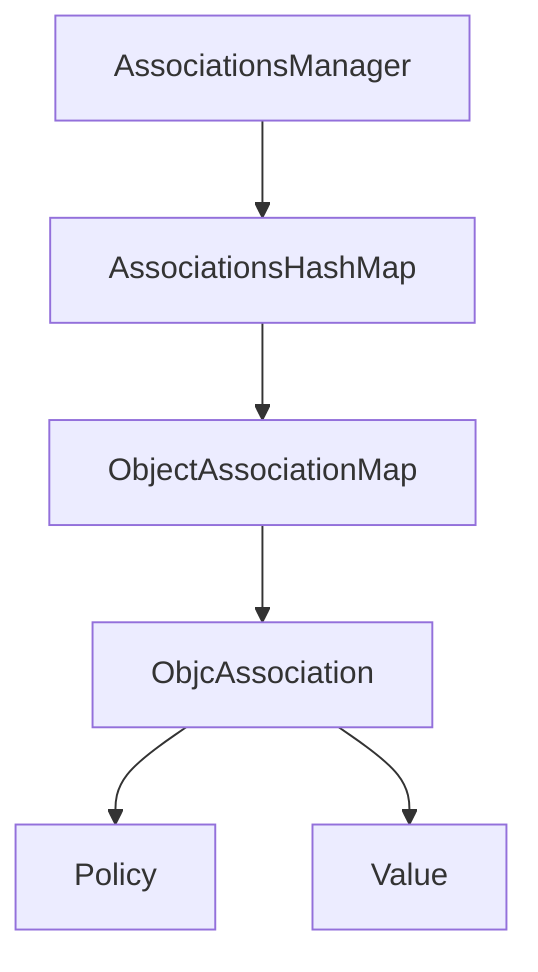
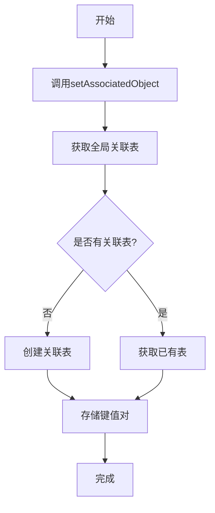
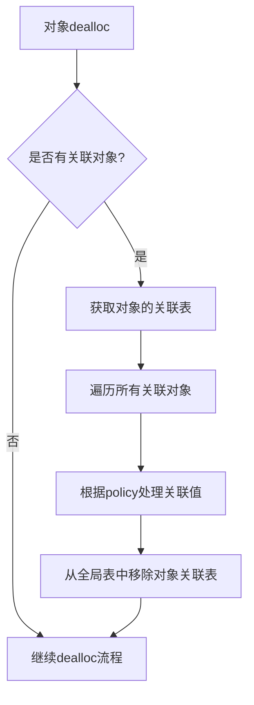
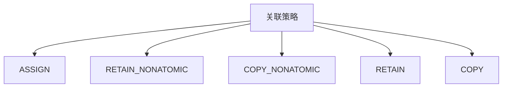

# Category关联对象的原理

## 关联对象的基本概念

在iOS开发中，Category（分类）是Objective-C的一个强大特性，允许我们在不修改原类的情况下为其添加方法。但原生的Category不支持添加实例变量。为了解决这个限制，Runtime提供了关联对象（Associated Objects）机制。

## 关联对象的原理图解

### 关联对象的基本结构



### 关联对象的工作流程



### 对象释放时关联对象的处理



## 关联对象的核心API

Runtime提供了三个API来管理关联对象：

1. **设置关联对象**
```objc
void objc_setAssociatedObject(id object, const void *key, id value, objc_AssociationPolicy policy);
```

2. **获取关联对象**
```objc
id objc_getAssociatedObject(id object, const void *key);
```

3. **移除所有关联对象**
```objc
void objc_removeAssociatedObjects(id object);
```

## 关联对象的内部实现原理

1. Runtime维护了一个全局的`AssociationsManager`，它管理着一个`AssociationsHashMap`哈希表

2. `AssociationsHashMap`以对象的指针为键，`ObjectAssociationMap`为值

3. `ObjectAssociationMap`以关联键（key）为键，`ObjcAssociation`为值

4. `ObjcAssociation`存储了关联策略（policy）和关联值（value）

5. 当对象被释放时，Runtime会自动清理该对象的所有关联对象

## 关联对象的内存管理

关联对象的内存管理由`objc_AssociationPolicy`策略决定：



## 使用示例

```objc
// 在UIView的分类中添加一个关联对象作为属性
@interface UIView (AssociatedProperty)
@property (nonatomic, strong) NSString *associatedTitle;
@end

@implementation UIView (AssociatedProperty)
- (void)setAssociatedTitle:(NSString *)associatedTitle {
    objc_setAssociatedObject(self, @selector(associatedTitle), associatedTitle, OBJC_ASSOCIATION_RETAIN_NONATOMIC);
}

- (NSString *)associatedTitle {
    return objc_getAssociatedObject(self, @selector(associatedTitle));
}
@end
```

## 注意事项

1. 关联对象不是存储在对象本身内存中，而是存储在全局的哈希表中
2. 过度使用关联对象会增加内存管理的复杂性
3. 在使用关联对象时，需要注意选择合适的内存管理策略
4. 关联对象的性能略低于实例变量，因为需要哈希表查找

希望这个图解能帮助您更好地理解iOS中Category关联对象的原理！

# Category 测试用例

## 关联对象的生命周期


## 关联对象的实现原理

### 1. 关联对象的存储结构
```objc
// 全局关联对象表
static AssociationsManager manager;
// 对象的关联表
AssociationsHashMap associations;
// 关联对象的值和策略
ObjcAssociation association(policy, value);
```

### 2. 关联对象的设置过程
```objc
void objc_setAssociatedObject(id object, const void *key, id value, objc_AssociationPolicy policy) {
    // 获取关联对象管理器
    AssociationsManager manager;
    // 获取关联表
    AssociationsHashMap &associations = manager.associations();
    // 设置关联对象
    associations[object][key] = ObjcAssociation(policy, value);
}
```

### 3. 关联对象的获取过程
```objc
id objc_getAssociatedObject(id object, const void *key) {
    // 获取关联对象管理器
    AssociationsManager manager;
    // 获取关联表
    AssociationsHashMap &associations = manager.associations();
    // 获取关联对象
    auto it = associations.find(object);
    if (it != associations.end()) {
        auto &refs = it->second;
        auto it2 = refs.find(key);
        if (it2 != refs.end()) {
            return it2->second.value();
        }
    }
    return nil;
}
```

## 测试用例

### 1. 基本使用测试
```objc
@interface TestObject : NSObject
@end

@interface TestObject (Associated)
@property (nonatomic, copy) NSString *name;
@end

@implementation TestObject (Associated)

- (void)setName:(NSString *)name {
    objc_setAssociatedObject(self, @selector(name), name, OBJC_ASSOCIATION_COPY_NONATOMIC);
}

- (NSString *)name {
    return objc_getAssociatedObject(self, @selector(name));
}

@end
```

### 2. 内存管理测试
```objc
- (void)testAssociatedObjectMemory {
    TestObject *obj = [[TestObject alloc] init];
    
    // 设置关联对象
    obj.name = @"Test";
    
    // 验证关联对象是否存在
    XCTAssertNotNil(obj.name);
    
    // 清除关联对象
    objc_setAssociatedObject(obj, @selector(name), nil, OBJC_ASSOCIATION_ASSIGN);
    
    // 验证关联对象是否被清除
    XCTAssertNil(obj.name);
}
```

## 注意事项

1. **内存管理**
   - 注意选择正确的关联策略
   - 及时清理不需要的关联对象
   - 避免循环引用

2. **性能影响**
   - 适量使用关联对象
   - 注意全局表的开销
   - 避免频繁操作

3. **线程安全**
   - AssociationsManager 提供了锁机制
   - 注意并发访问的问题
   - 合理使用同步机制
